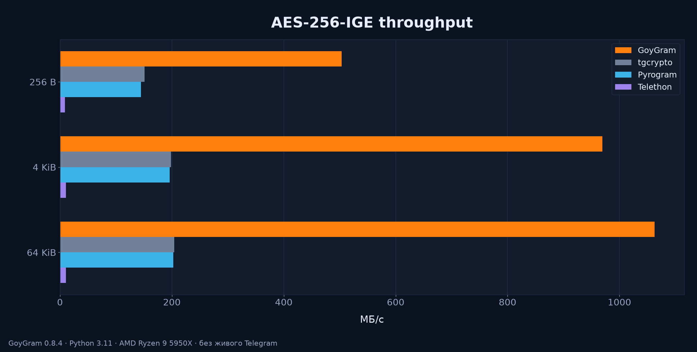
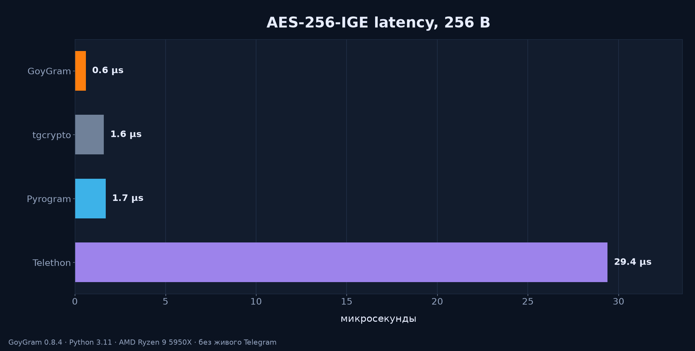
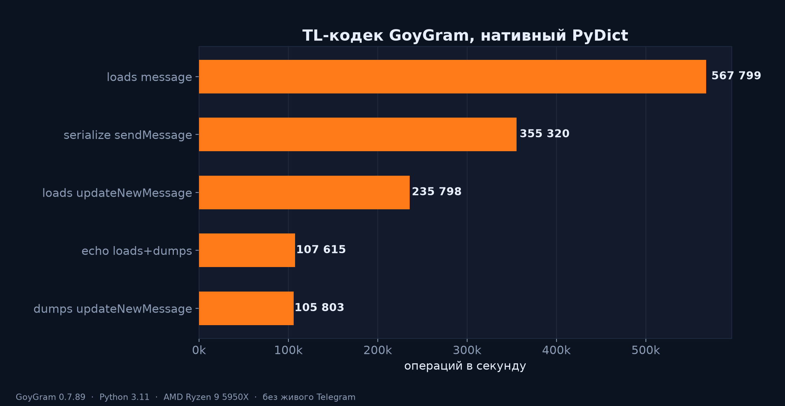
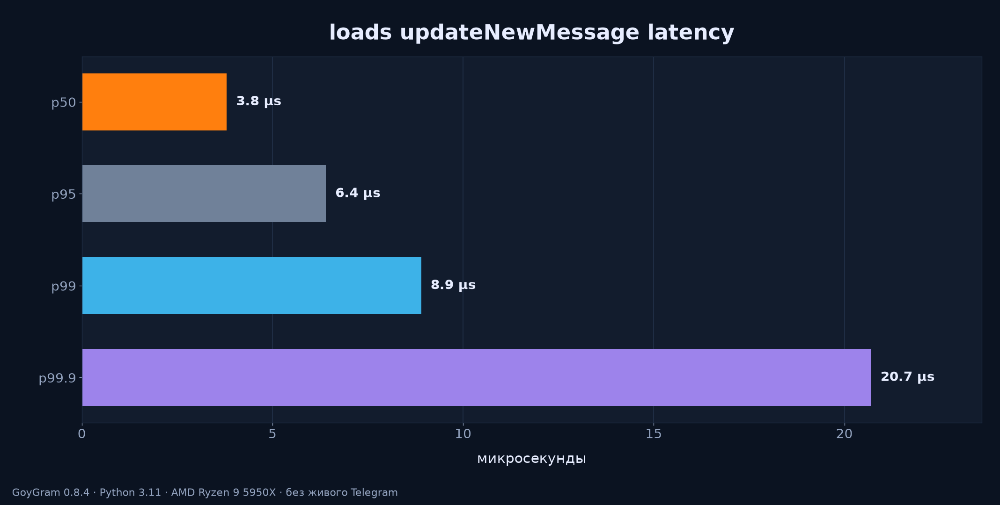
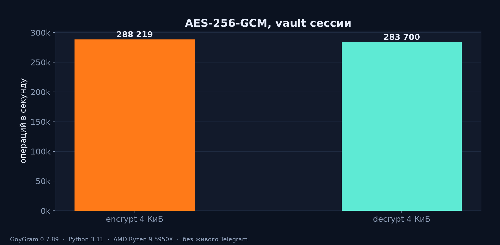
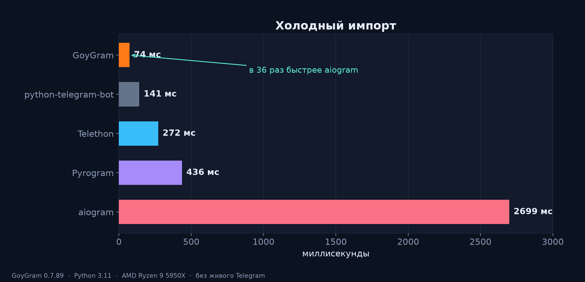
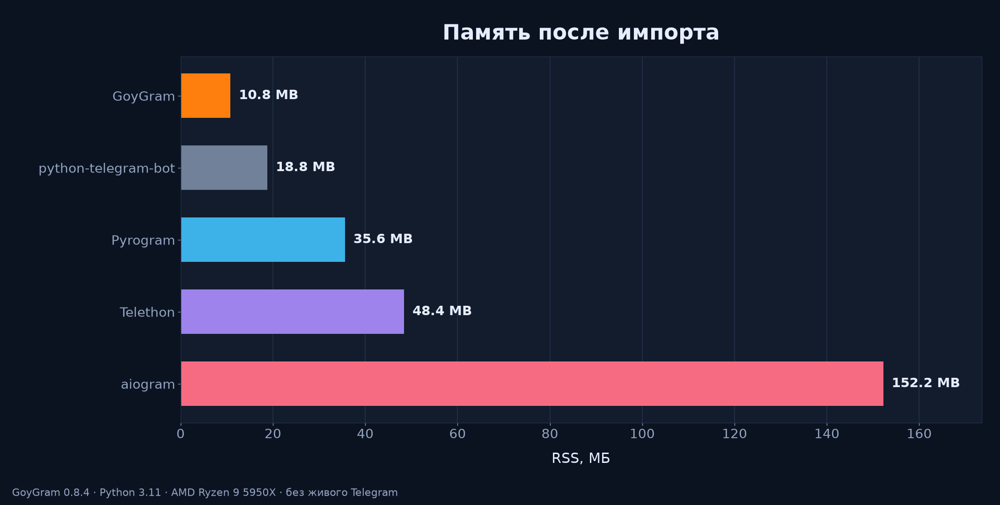

# Benchmarks

Reproducible comparisons of GoyGram against the major Python Telegram libraries.

## What is measured

1. **AES-256-IGE throughput and latency** — MTProto packet encryption.
2. **TL codec (simple)** — serialize `messages.sendMessage`, deserialize a `message` object.
3. **TL codec (realistic)** — native PyDict `dumps`/`loads` of `updateNewMessage` (text, forward, inline buttons). Latency percentiles on `loads`.
4. **AES-256-GCM throughput** — vault encryption.
5. **Cold import time**.
6. **Memory footprint** — RSS after import.

Not measured: live Telegram, a mock DC, C10K sessions.

## Environment

| Component | Version |
|---|---|
| Python | 3.11 |
| goygram | 0.7.89 (Rust core, AES-NI, native PyDict) |
| telethon | 1.44.0 |
| pyrogram | 2.0.106 |
| aiogram | 3.31.0 |
| python-telegram-bot | 22.8 |
| tgcrypto | 1.2.5 |

A single VPS (AMD Ryzen 9 5950X, 6 vCPU). Codec and GCM re-run on 0.7.89. IGE/import/RSS are the same box.

## Results

### AES-256-IGE throughput (MB/s, higher is better)

| Library | 256 B | 4 KiB | 64 KiB |
|---|---|---|---|
| goygram (Rust, AES-NI, built-in) | 544 | 1001 | 1094 |
| tgcrypto (C, separate install) | 168 | 224 | 234 |
| pyrogram | 168 | 223 | 228 |
| telethon (default) | 12 | 14 | 14 |



GoyGram dispatches to AES-NI at runtime. tgcrypto 1.2.5 is table-based software AES. Network RTT still dominates a real client.

Per-message latency at 256 B (lower is better): goygram 0.4 µs, tgcrypto 1.3 µs, pyrogram 1.4 µs, telethon 23 µs.



### TL codec, simple (ops/s, higher is better)

| Operation | ops/s |
|---|---|
| serialize `messages.sendMessage` | 355,320 |
| loads `message` | 567,799 |



### TL codec, realistic `updateNewMessage` (ops/s)

Payload: ~200-char text, `messageFwdHeader`, inline keyboard. Packet 356 B.

| Operation | ops/s |
|---|---|
| dumps `updateNewMessage` | 105,803 |
| loads `updateNewMessage` | 235,798 |
| echo loads+dumps | 107,615 |
| AES-256-IGE enc+dec of that packet | 862,432 |

loads latency (µs): p50 3.7, p95 6.5, p99 9.1, p99.9 26.5.



### AES-256-GCM (4 KiB, ops/s)

| Operation | ops/s |
|---|---|
| encrypt | 288,219 |
| decrypt | 283,700 |



### Cold import time (ms, lower is better)

| Library | ms |
|---|---|
| goygram | 74 |
| python-telegram-bot | 141 |
| telethon | 272 |
| pyrogram | 436 |
| aiogram | 2699 |



### Memory footprint, RSS delta after import (MB, lower is better)

| Library | MB |
|---|---|
| goygram | 13 |
| python-telegram-bot | 19 |
| pyrogram | 35 |
| telethon | 48 |
| aiogram | 152 |



## Honest notes

- **No live Telegram.** A mock MTProto DC, 10k sessions, and hour-long leak runs are not in this folder.
- **tgcrypto loses on raw AES-IGE now.** tgcrypto 1.2.5 is table-based software AES; GoyGram dispatches to AES-NI. Network RTT still dominates a real client.
- **Telethon's default IGE path is slow** because it drives OpenSSL through ctypes. `cryptg` is optional.
- **aiogram import/RSS** are pydantic v2.
- **Schema load** (layer 229, 823 methods, 1698 constructors) is once per process. Warm `loads` is a few microseconds.

## Reproduce

```bash
uv venv .bench && source .bench/bin/activate
uv pip install goygram telethon tgcrypto pyrogram aiogram python-telegram-bot
python bench_crypto.py
python bench_codec.py
python bench_import.py
```
